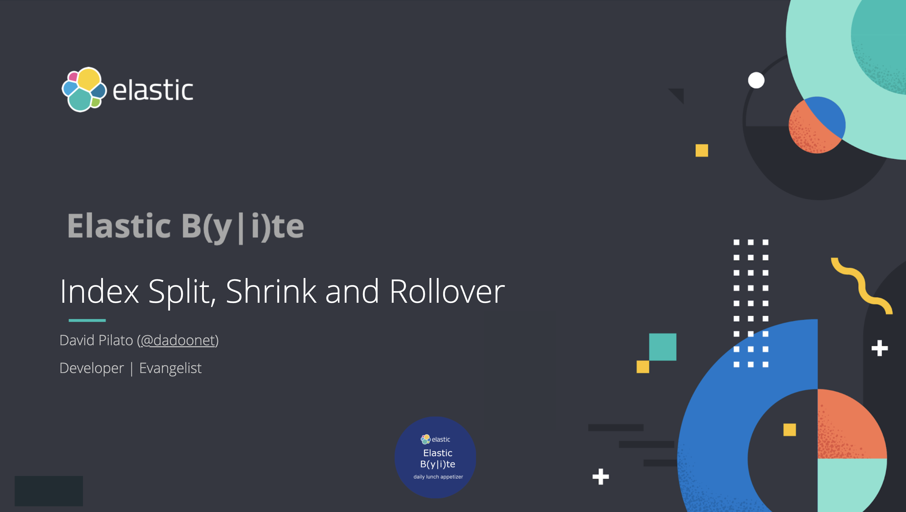

# Demo scripts used for Elastic Daily Bytes - Index Split, Shrink and Rollover



## Setup

The setup will check that Elasticsearch and Kibana are running and will remove any index named `kibana_sample_data_ecommerce*`, `demo-rollover*` and the index template `demo-rollover`.

It will also add Kibana Canvas slides.

### Run on cloud (recommended)

This specific configuration is used to ingest the whole bano dataset on a [cloud instance](https://cloud.elastic.co).
You need to create a `.cloud` local file which contains:

```
CLOUD_ID=the_cloud_id_you_can_read_from_cloud_console
CLOUD_PASSWORD=the_generated_elastic_password
```

Run:

```sh
./setup.sh
```

### Run Locally

Run Elastic Stack:

```sh
docker-compose down -v
docker-compose up
```

And run:

```sh
./setup.sh
```

## Demo part

Open Kibana home, and click on the "Add data" and add the Sample eCommerce orders dataset.

### Split

Run a search and check the number of shards (1) and documents (4675)

```
GET /kibana_sample_data_ecommerce/_search?size=0
```

Let say we want to split this index into 10 shards as our shard is overloaded (not the case here though).

```
POST /kibana_sample_data_ecommerce/_split/kibana_sample_data_ecommerce_target
{
  "settings": {
    "index.number_of_shards": 10
  }
}
```

This will fail because before you can split an index:

* The index must be read-only.
* The cluster health status must be green.

Change the index settings and add `"index.blocks.write": true`:

```
PUT /kibana_sample_data_ecommerce/_settings
{
  "settings": {
    "index.blocks.write": true
  }
}
```

And run again the previous command:

```
POST /kibana_sample_data_ecommerce/_split/kibana_sample_data_ecommerce_target
{
  "settings": {
    "index.number_of_shards": 10
  }
}
```

Display the recovery in progress

```
GET /_cat/recovery/kibana_sample_data_ecommerce*?v&h=index,files,files_recovered,files_percent,files_total
```

Run a search and check the number of shards (**10**) and documents (4675)

```
GET /kibana_sample_data_ecommerce_target/_search?size=0
```


### Shrink

Before you can shrink an index:

* The index must be read-only.
* All primary shards for the index must reside on the same node.
* The index must have a green health status.

Check shards allocation and get the name of a data node like `"instance-0000000001"`.

```
GET /_cat/shards/kibana_sample_data_ecommerce*?v&h=index,shard,prirep,state,docs,node
```

To make shard allocation easier, we recommend you also remove the index’s replica shards. You can later re-add replica shards as part of the shrink operation. So the following command will do the job.

```
PUT /kibana_sample_data_ecommerce_target/_settings
{
  "settings": {
    "index.number_of_replicas": 0,
    "index.routing.allocation.require._name": "instance-0000000001", 
    "index.blocks.write": true
  }
}
```

Check shards allocation. We only have primaries on a single node.

```
GET /_cat/shards/kibana_sample_data_ecommerce*?v&h=index,shard,prirep,state,docs,node
```

We can shrink the index from 10 shards to 2 shards. We also remove the node allocation, make the index writable again and set the number of replicas back to 1.

```
POST /kibana_sample_data_ecommerce_target/_shrink/kibana_sample_data_ecommerce_shrunk
{
  "settings": {
    "index.routing.allocation.require._name": null,
    "index.blocks.write": null,
    "index.number_of_replicas": 1,
    "index.number_of_shards": 2 
  }
}
```

Check shards allocation.

```
GET /_cat/shards/kibana_sample_data_ecommerce*?v&h=index,shard,prirep,state,docs,node
```

Run a search and check the number of shards (2) and documents (4675)

```
GET /kibana_sample_data_ecommerce_shrunk/_search?size=0
```

### Rollover

Create an index template for the `demo-rollover` indices. It basically creates a read alias for each new index starting with `demo-rollover-`.

```
PUT _index_template/demo-rollover
{
  "template": {
    "mappings": {
      "properties": {
        "foo": {
          "type": "keyword"
        }
      }
    },
    "aliases": {
      "demo-rollover": {}
    }
  },
  "index_patterns": [
    "demo-rollover-*"
  ]
}
```

There's an alias `demo-rollover` which is basically the read alias.

Create an index `demo-rollover-000001` with the `demo-rollover-write` alias. We will start writing to this alias.

```
PUT demo-rollover-000001
{
  "aliases": {
    "demo-rollover-write": {}
  }
}
```

Index some documents with the `run.sh` script which runs peridiodically:

```
POST demo-rollover-write/_doc
{
  "foo": "bar"
}
```

Check the number of documents by index name.

```
GET demo-rollover/_search
{
  "size": 0, 
  "aggs": {
    "index": {
      "terms": {
        "field": "_index",
        "order": {
          "_key": "asc"
        }
      }
    }
  }
}
```

Sometime run the rollover API call. You can put this call in a crontab for example.

```
POST /demo-rollover-write/_rollover
{
  "conditions": {
    "max_docs":  10,
    "max_age":   "7d",
    "max_size": "20gb"
  }
}
```

Check the indices

```
GET /_cat/indices/demo-rollover*?v&h=index,pri,rep,docs.count&s=index
```

Check the aliases

```
GET /_cat/aliases/demo-rollover*?v&h=alias,index&s=index
```
